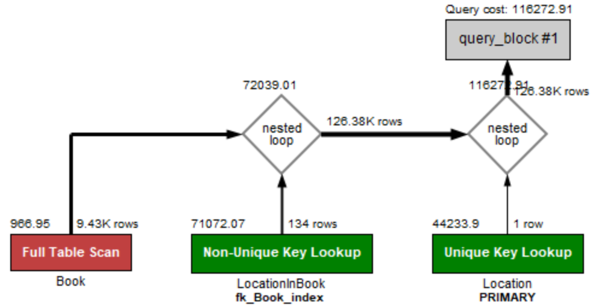

# Database Project Report
## *The Gutenberg Database project*


_Picture 1_

**Written by**

*Christian Engelberth Olsen, Viktor Kim Christiansen, William Pfaffe, Chris Rosendorf* 

**Group: Dolphin Boys**

**Due date: 30th of May 2019 07:00**

**Copenhagen Business Academy**

------

# **Introduction**


_Picture 2_

## **Gutenberg**

Johannes Gutenberg was the man who invented the printing press around the year 1439, making it possible to print books and others text, for easier distribution and greater availability.

The Gutenberg Project, which this database project is somewhat inspired by, is the oldest digital library of books in the world. The project was started back in 1971 by Michael S. Hart, with the objective of digitizing, preserving and sharing as many books and text as possible, from around the world and for free to use.


## **Database project goals and objectives**

This report will give insight into the development and proposed solution to the Gutenberg database project by the Dolphin Boys group.

The goal of this database project was to select two types of databases (MySQL, MongoDB or Neo4j), build the appropriate data models in each database, import the data from the given data files from https://www.gutenberg.org and http://www.geonames.org/ (such as the data for books and cities) into each database, build a small frontend application and add support for four specific queries and display the results:

1. _Given a city name your application returns all book titles with corresponding authors that mention this city._
2. _Given a book title, your application plots all cities mentioned in this book onto a map._
3. _Given an author name your application lists all books written by that author and plots all cities mentioned in any of the books onto a map._
4. _Given a geolocation, your application lists all books mentioning a city in vicinity of the given geolocation._

The original project description and task can be found [here](https://github.com/datsoftlyngby/soft2019spring-databases/blob/master/Exam/GutenbergProject.md) and within this repo are two folders with the teams suggested solution for the project:

*   **DBFinal** 
    *   Serves as both the projects backend and a very small frontend (built using server-rendering HTML). 
*   **ImportData**
    *   The part of the project that imports information from the various data-files and sends it to the databases.

The team developed the project using TypeScript (JavaScript), due to the team's previous experience developing with it, as well as the teams confidence that it could live up to all the assignment requirements. 

------

# **Which database engines are used**


_Picture 3_

The team opted to develop the project using the following two database-engines:

*   MySQL
    *   Relational Database (SQL)
    *   Queries: SQL Statement
    *   Support ACID (Atomicity, Consistency, Isolation, Durability )
    *   A “familiar” database
*   Neo4j
    *   Graph Database (Build on NoSQL)
    *   Queries: Cypher Statement
    *   Support ACID (Atomicity, Consistency, Isolation, Durability )
    *   An “Unfamiliar” database

## **Time vs Challenge**

Before discussing the choice of the two selected databases, the team wanted to make a few things clear in regards to balancing Time vs Challenges. 
Beside the technical thoughts and concerns that went into the database selection process, the team also took into consideration that it was also knee-deep in developing other projects and exam preparations for other courses. This meant that for this project, the team wanted to strike the right balance between developing and delivering a solid and interesting project, while at the same time challenging the team to try and to learn new technologies, tools and techniques. In other words, the team wanted to try and avoid relying using only technologies and tools that the team was too familiar with, to save time. 

With this this Time vs Challenge in mind, the team made a very simple and rough sketch of the visualisation of the “queries and databases”-part of the assignment. How to perform queries are of course different from database to database, but when looking at the sketch the team decided to develop the project using a database that the team was familiar with and one that the team was not so familiar with. 
The team also decided that development would begin first on the database that the team was familiar with, because the team believed that if the familiar database was successfully developed first and was functional, it would give the team a better idea and grasp of the challenges awaiting when developing the other unfamiliar database.


_Rough paint sketch used to visualise the teams thoughts regarding queries and databases_


## **Database #1 - The familiar database**


The choice of the _MySQL_ database-engine was based on the fact that the team have had a lot of previous experience with the relational databases from previous projects, but never with so big a data set. The team knew that some of the challenges using a relational database in such a project would be:


*   Importing such a big data set, while maintaining 1NF, 2NF and 3NF 
*   Creating queries to retrieve data across multiple tables 
*   Working with a huge data set


## **Database #2 - The unfamiliar database**

The choice of _Neo4j_ was based on the teams desire to learn more about working with the graph based database-engine, which (like _MongoDB_) was build on Nosql. The engines capability to visually display the data very differently than the other engines (_MySQL and MongoDB_) with the whole _node_-concept and _relationships_ was also very intriguing to the team. Furthermore, the team believed that if the _MySQL _part of the project was developed first and was successfully, the team would have more time experimenting with trying to translate the _MySQL_-queries into similar cypher statement and use them in _Neo4j_, since cypher statements use similar SQL clauses. Also, according to the neo4j-website itself, the database is touted as being “_easy to learn, easy to use_”<sup>1</sup>, as well as _“being easy to transition to, from a relational database developer”<sup>2</sup>_.

Some of the concepts and challenges that the team looked forward to work with in _Neo4j_ was:


*   Cypher statements (compared to SQL statements in _MySQL_)
*   Working with Nodes, Labels, Relationships, Relationships Types, Properties, Traversel and paths
*   Finding Javascript-compatible libraries and drivers
*   Another type of _Nosql_-database   


## **Why “that” database-engine was not chosen**


_Picture 4_

Despite previous mixed experience with the database-engine among the team members, it was decided not to develop the project with MongoDB (Document-based/Non-Relational/NoSQL).
This was mainly because the team wanted a challenge during development and had less experience working with Neo4j than MongoDB, and combined with the fact that both MongoDB and Neo4j database-engines are based on NoSQL, the team ultimately chose Neo4j.


## **Recapping choice of database-engines**

As previously stated, the team wanted to find the right balance between _Time_ vs. _Challenge_ and there were three possible scenarios of database combinations:

*   _MySQL_+ _MongoDB_
*   _MySQL_ + _Neo4j_
*   _MongoDB_ + _Neo4j_
 
In one of those scenarios, and with the _Time_ vs. _Challenge_ in mind, one could easily have questioned the teams choice of choosing two databases that were both based on Nosql, had the team opted to go with a combination of _MongoDB_ + _Neo4j_. 

Going with the combination of _MySQL_ and _Neo4j_ was therefore a [twofer](https://english.stackexchange.com/questions/274369/another-term-phrase-for-kill-two-birds-with-one-stone) for the team, in that:


*   The team would develop the project using two very different database engines, an SQL- and a NoSql-database.
*   The NoSql-database was of the graph-type _Neo4j_, which the team did not have as much experience with, compared to a another NoSQL-database like _MongoDB_. 

-----

# **How data is modeled in the database**


_Picture 5_

The purpose of this chapter is to give an insight into the teams thoughts regarding how the data was modeled in both the _MySQL-_ and _Neo4j_-database.

## **MySQL**


_Screenshot of the MySQL data model and structure_

The data structure for MySQL is structured so that it’s both easy to work with, and performant. Given the RDF formats, and the data known in the data structure of the local zip files and metadata files, each book has multiple authors, and each author has a reference to all his / her books. Each author however, doesn’t have a reference to each book in their own table, but rather a joint table with the name _BookWrittenBy** **_which contains the indexes of the _Author_- and _Book_-table, making lookups and future references easy to handle. Usually this sort of structure is created for **n*n** type of tables, and the following theme is also followed for _LocationsInBook_, containing the indexes for which book, mentions which location. Each mention will receive their own row. The database engine used is the default one, InnoDB. It’s one of a few that support foreign key constraints, and it’s the usual vanilla when it comes to running MySQL databases. There’s also MariaDB, and others like it, however we didn’t see it fit to use any other, since some work tools like Workbench has troubles with other engines (Notably MariaDB).

**Pros**

The pros of this given structure, is that it’s an ease to work with (in some ways). Instead of having multiple authors within the same author table, incase the author has more than one book, it’s refined to having the indexes given in a many-to-many table.

**Cons**

The issue with having a many-to-many table, and especially relying on them in multiple tables, is deleting one element. This is not as severe in our case, but multiple references can cause simple tasks to be prolonged due to either figuring out the data structure or determining if something should be deleted. Likewise with a scenario we had in one assignment, a retailer with a webshop. The retailer should never delete a product, as it will lose it’s reference in case it gets discontinued. Deleting the product will provide a dead end for all receipts that reference that product. Having said that, it’s also a general case with databases, although more difficult with many-to-many tables. 


## Neo4J

Data is modelled somewhat after our interpretation of what the MySQL Data would look like. However, Neo4j luckily has support for many to many relations, which removes the need for many-to-many tables, specifically to keep references. Each author has a relation to the book that they “Wrote”, and multiple books can be written by the same author, likewise the book can have many different authors. Each author consists of a name and a ID. Each book, contains an id and the title of the book. 


_Screenshot of a relationship (wrote) in Neo4j, between an author and a book, from the project_


_Model of a relationship (wrote) in Neo4j_

Each book also has a relation, to a Location datatype, which contains the name of the city, latitude and longitude. A relation is then created between the city and the Location given the name of the city.

**Pros**

Easy to work with, JSON objects within the Cypher query language, making it easy to write scripts. Data Structure also makes it easy to do the 4 following tasks that were given by the assignment (Finding references from books, authors etc).

**Cons**

Unfortunately, due to inexperience with Neo4J, our data model is somewhat crippled when importing data. For each author, we create a new author, and a new book, rather than looking for existing books. This creates a large amount of data to look through, since each book also has relations to each Location, making it very hard to filter through after large amounts of data.


_Screenshot of a relationship (mentions) in Neo4j, between an book and locations, from the project_


_Model of a relationship(mention) in Neo4j_

--------

# **How the data is imported**


_Picture 6_

The general gist when creating the application, was to keep the requests formal, as in all the data is the same, and easily accessible. The application is a HTTP Server, capable of returning JSON data, and rendering HTML files server side, using Express. Due to the nature of intellisense with regular NodeJS, we’ve opted in to develop this project with static typing, allowing us to easily identify objects and their sub-variables. Depending on the endpoint, the data is given differently. Each endpoint is the same, only difference is the /mysql/ or /neo/ that comes before the API Name. Here’s an overview of the available endpoints:


*   **findBooksFromCity {POST}**
    *   Returns a JSON list of all cities that the book title mentions

```javascript 
interface BookAndAuthors{ 
    title: string,
    authors: string[]; 
}
```

*   **html {POST}**
    *   Returns a map with all the locations plotted, given the book title.
*   **html2 {POST}**
    *   Returns a map, with all the locations plotted, and a list shown beneath the map, given the author, with all his / hers book titles.
*   **vicinity {POST}**
    *   Given a latitude, and longitude, returns a list of all books, and their authors nested inside as a JSON object.

```javascript 
interface BookAndAuthors{ 
    title: string,
    authors: string[]; 
}
```

As described above, all these endpoints are available for Neo4j, and MySql, and have each their queries written for each of the selected database solutions. Given our data modeling solution for Neo4j, and MySQL, some things are enforced on the server side, such as adding each element into a hashmap to disallow duplicates, and thereafter returning all their values. This doesn’t add much to the performance decrease, as it’s complexity is O(n). However, due to the structure of our Neo4J data models, some queries for Neo4J will be considerably slower, due to the amount of data duplication we’ve encountered. The maps are displayed using Google Maps API, which allows you to easily display a map given data points, that can have a title (Which in our case is the name of the city).


-------

# **How the data is imported**


_Picture 7_ 

After having set a droplet to download the data, using the hints provided in the assignment description<sup>3</sup>, we were presented with with the problem of determining how to extract the author(s) and the title of the book. \
Initially the team tried seeing if there was a structure in the books that allowed for an easy extraction from the txt files - these are found by unzipping the zip files, but after careful observation we determined that the inconsistent way each books presents their author and title would make it a huge hassle to do that way, thus we searched for a different approach.

 \
This came in the form of searching through each rdf file, for the corresponding file number, given as the zip name. We used grep, as this was a useful and easy to use tool that we could call quite easily from NodeJS. The searching for a single file took upwards of 30-40 seconds each, and with time that would slowly lower, as we would exclude more and more files for it to search through (We estimated an average of ~20 seconds a book, over the course of all 55k). This approach seemed like it was at least possible, compared to the previous idea, but still seemed like it would take too long to actually get finished, as the time it took was only searching for the file. On top of that, we’d need to search the file itself for all the cities it mentioned, and take into consideration inserting all the data into the database.

We tackled the cities mentioned in a very primitive way - we initially considered making a trie to quickly lookup each word from the text, and determined if that was a city name, although the main problem we saw was that it was difficult to determine when to stop the search, as there is a city named “Bo”, so is “Body” a city? Definitely not, so it must continue till it has reached a space. Also, some cities have spaces in their name, so how would we go about determining if they are valid? There were a lot of cases that made it difficult to ensure both cases, so we ended up doing a reverse lookup, looking at each city name, and determining if it was present in the book that was being processed.

String search is luckily relatively fast, so even though there were many thousands of cities, and potentially many thousands of words in each book, the lookup should maximum take a few seconds to complete - where smaller books of course would finish in a timely manner.

With regards to linkin the rdf files to the specific books, we could not come up with a better plan than what was already thought out, but we noticed a pattern in the zip file names, that drastically reduced the search time - all the numerical file names had the exact same corresponding rdf file name, reducing our search space to a single index lookup, which is almost optimal. We adjusted our algorithm accordingly, disregarded the few files that had non numerical file names (such as _sesli10.zip_) and started running the import script for the data.

It ran for some time, but we ran into problems with some of the zip files not only including their book, but nesting the book inside a folder - this was observed on a few occasions, but rare enough that we decided to just skip them, than add additional logic to recursively check folders for any matching file, although this could have been a reasonable solution, too.


------

# **Behavior of query test set**


_Picture 8_

### *Including a discussion on how much of the query runtime is influenced by the DB engine and what is influenced by the application frontend.*

Below is a graph of 18 queries, being run both on mysql and neo4j.


The X Axis is the amount of data points, and Y Being total milliseconds. It’s important to differentiate 2 things, that occurred in this test:


*   Mysql and Neo4j is hosted on the same VPS (4 Threads, 8 Gb of Ram)
*   The import script is running on the same VPS as well

Having said that, looking at the performance of Neo4J, it’s clear that it’s not up to par with the given task. MySQL is running somewhat flawlessly, apart from spikes when Neo4J takes up all threads on the VPS and blocks most of the performance.   
 
The data is although dependant on the latency between the benchmark program being run, and the VPS. The general latency was 32 under normal loads, although latency spikes when Neo4J tries to create relations for all the locations and books, which occupies most threads. 
 
Much of the latency comes from Neo4J, rather than the backend itself. The HTTP Api that was tested against doesn’t render anything, although it returns a list of all titles and it’s authors. MySQL does the same, although it’s all time lows and general latency was way lower than that of Neo4J (Running queries on a client tool also proves this theory). 
 
The cause of this, as described in previous topics in this report, could be one of either


*   Our data model is completely off, causing massive delays and spikes in performance
*   The queries we made are extremely bad performance wise, causing comparisons or lookups to be badly performant
*   The VPS simply isn’t powerful enough for running both databases (Although unlikely)


## **Execution Schedule**


* **1**. The query being run here is the one that returns all books and authors, mentioning a specific city. Issue here is clearly that we have not created indexes for the specific tables.


_Screenshot of the MySQL Execution plan, for getting all books and it’s authors given a city name_

* **2**. Due to the missing indexes, there’s no specific pointer to which row that we’re referencing, or rows, apart from a value which isn’t indexes, causing the query to run through all possible elements (Hence the full table scan).





_Screenshot of the MySQL Execution plan, for returning all locations in which a book mentions_

* **3**. Once more, indexes are missing. There’s quite a few elements in our many-to-many table (Around a million or more), causing it to be very large. Although once more, no index is causing the lookups to be severe (The author name as well as book title).


_Screenshot of the MySQL Execution plan, for returning all locations and book titles given a author name._

* **4**. Without sounding too repetitive, same case once more. A fulltext index on the title of the book would do wonders in our case.


_Screenshot of the MySQL Execution plan, for returning all books within a certain vicinity of a geographic point._

------

# **Your recommendation, for which database to use in such a project for production**


_Picture 9_

Before discussing which database-engine to chose, one must first layout the specifications and terms for the project, as well as analysing the potential challenges and obstacles, in order to better put the pros and cons of the various databases into better context.

The specifications and terms for the project was to:


*   Build a small application that figures out which cities are mentioned in which English books from Project Gutenberg, given a city which books mentioned it, and given a location, which books mention cities in vicinity.
*   Select two database-engines to work with
*   Download data sets
    *   List of Books
    *   List of Cities
*   Import downloaded data to databases
*   Application Queries
    *   _Given a city name your application returns all book titles with corresponding authors that mention this city._
    *   _Given a book title, your application plots all cities mentioned in this book onto a map._
    *   _Given an author name your application lists all books written by that author and plots all cities mentioned in any of the books onto a map._
    *   _Given a geolocation, your application lists all books mentioning a city in vicinity of the given geolocation._


## Analysing challenges and obstacles

With the project terms and specifications laid out, one can start to analyse some of challenges and obstacles facing building the application:

*   The Data
    *   Two separate datasets is to be used for the assignment
    *   Downloaded as .txt files
        *   May need some conversion to .csv or other format to better be read by a database
        *   Each set contains a lot of data, some not needed or required by the assignment
            *   Either filter the important from the unimportant, before importing to the database, to keep the size of the data minimal.
                *   Suggestion: use RegEx
            *   Import everything in the dataset to the database, including unnecessary data, with no regards for memory space.
                *   Suggestion: Add headliners for fields and columns 
    *   Each dataset contains various information and details, which needs information from the other, in order fulfill some of the queries.
        *   Cities
            *   Contains data for 5000-33240 cities!
                *   Depending on which cities-dataset is downloaded
                *   Size of the datafile is from 5-25 MB
            *   Need the information for the following
                *   Name of the City
                *   Location Coordinates (Latitude, Longitude)
        *   Books
            *   Contains gigabytes of data!
            *   Data consists of entire books!
            *   Need to extract information such as
                *   Name of Author
                *   Book Title
                *   Locations mentioned in the book
*   The Queries
    *   _Given a city name your application returns all book titles with corresponding authors that mention this city._
        *   Need data from only the _books_ dataset
            *   Input: A city name
            *   Output: List of book titles that mentions the city
    *   _Given a book title, your application plots all cities mentioned in this book onto a map._
        *   Need data from both the _cities_- and _books_-dataset
            *   Need to search the _books_-dataset, to find all the cities mentioned in the book
            *   Need to search the _cities_-dataset, to find the coordinates for the mentioned cities
        *   Input: A city name
        *   Output: Map of all the mentioned cities
    *   _Given an author name your application lists all books written by that author and plots all cities mentioned in any of the books onto a map._
        *   Need data from both the _cities_- and _books_-dataset
            *   Need to search the _books_-dataset, to find all the cities mentioned in the book
            *   Need to search the _books_-dataset, to find all the books written by the author
            *   Need to search the _cities_-dataset, to find the coordinates for the mentioned cities
        *   Input: Author Name
        *   Output: 
            *   List of Books written by the author
            *   Show a map of all the cities mentioned in the books
    *   _Given a geolocation, your application lists all books mentioning a city in vicinity of the given geolocation._
        *   Need data from both the _cities_- and _books_-dataset
            *   Need to search the _cities_-dataset, to find the potential cities in the geolocation/vicinity
            *   Need to search the _books_-dataset, to find all the books that has mentions of the cities found located in the geolocation 
        *   Input: Geolocation/Vicinity
        *   Output: List of Books that has mentions of a city in the given geolocation/vicinity

## **Quick and short recap of the Database-engines**

The team wanted to quickly recap the different database-engine and their features, very shortly (because the team could spend hours and pages on describing every little detail regarding each database)


_Picture 10_

A database-engine based on SQL, which is based on the Relational Database Management System (RDMS), which is more commonly known as a relational database. MySQL has been around for a long time and is therefore greatly supported by a large community. A few key concepts and features of MySQL are _tables, columns, rows, normalization, sql constraints, data integrity, replication_ and _ACID_.
As of this writing, MySQL is the second overall-most popular database engine, only behind Oracle, according to db-engines.com<sup>4</sup>.


_Picture 11_

MongoDB is a Document-based database, which is based on NoSQL, and because of its schema-less nature it is regarded as being highly flexible and easy to scale. A few key concepts and features of MongoDB are _Collections, Documents, default _id, dynamic schema, BSON/JSON, dynamic queries, clear single object structure, replication and high availability, fast in-place updates, no complex joins, auto-sharding _and (as of 2018) _multi-document ACID_.

As of this writing, MongoDB is the fifth overall-most popular database engine, but number one amongst Document-databases, according to db-engines.com<sup>4</sup>.


_Picture 12_

Neo4j is a graphs-database, which is based on NoSQL. Neo4j presents its data very visually, compared to the more text-based representations found in MySQL and MongoDB. This is done by displaying the data as objects and linking them together to show relationships among each other, with no need for a third-party tools to visualize this. A few key features and concepts of Neo4j are _flexible data model (flexible schema), real-time insight, high availability, easy retrieval, cypher query language, connected and semi structured data, no joins, acid support, scalability and reliability_ and _built-in web application_.

As of this writing, Neo4j’s the 22 overall-most popular database engine, but number one amongst Graph-databases, according to db-engines.com<sup>4</sup>.

## **Final recommendation**


_Picture 13_

The team would recommend Neo4J for production. 

Despite the teams mixed results of developing a database using Neo4j for this project, the lessons learned and experience gained, would definitely help if the team was to redo the project. On paper, the given assignment presented for the project seems tailor made for Neo4j, since the objectives seems to revolve around showing relations between data, such as showing which books were written by which author, displaying the cities mentioned in a given book etc.

The team would opt not to use MySQL for production of this project, because when searching for data and relations, queries can become quite complex due to the need of _joins_.  In theory, execution time for MySQL should be longer compared to Neo4j, due to the queries in MySQL having to dig through the database to find the relations, whereas the Neo4j queries already know the relations. In addition to this, if more tables were added to the MySQL database, the complexity and time consumptions for searches would increase. 

The team would not opt to use MongoDB for production of this project, mainly due to the amount of potential duplicate data. While the team definitely sees the advantage of having data being stored in the document-structure of MongoDB, thus eliminating the need for _relations_ as in Neo4j and _joins_ MySQL when searching and querying, the amount of references to cities mentioned by a book by a author, makes the team fear that the database would be overblown with duplicate data. While _relations_ and _joins_ can be achieved in MongoDB by _aggregation_, the team believes using that technique in queries would break the document-based nature of MongoDB.


----
# **Literature and Sources**

## Text
1. _"5: Easy to Learn"_ and _"6: Easy to Use"_ https://neo4j.com/top-ten-reasons/ 12/5-2019
2. _"Translating Your Relational Knowledge to Understand Graphs"_ https://neo4j.com/developer/graph-db-vs-rdbms/ 12/5-2019
3. _“A description on how to automatically download these books is available here”_ - Kasper Østerby 12/5-2019 : https://github.com/datsoftlyngby/soft2018spring-databases-teaching-material/tree/master/book_download
4. https://db-engines.com/en/ranking 29/05-2019


## Pictures
* Picture 1: https://imgc.artprintimages.com/img/print/sorry-bub-you-re-not-in-the-database-cartoon_u-l-pgrqxl0.jpg?h=550&w=550 19/5-2019
* Picture 2: https://srirangachary.files.wordpress.com/2015/06/dilbert-database2.jpg 19/5-2019
* Picture 3: https://cdn.lynda.com/course/510082/510082-636876467695443466-16x9.jpg 19/5-2019
* Picture 4: https://biguru.files.wordpress.com/2014/10/nosqlcartoon.png 19/5-2019
* Picture 5: http://static.squarespace.com/static/518f5d62e4b075248d6a3f90/t/51edaab6e4b008f85ce59859/1374530255950/gdm.jpg?format=1000w 19/5-2019
* Picture 6: https://tedamoh.com/images/blogposts/2017/ModelDiscussion.jpg 19/5-2019
* Picture 7: https://www.cockroachlabs.com/uploads/2017/10/Bulk-Ingest-by-Quentin-Vijoux.jpg 19/5-2019
* Picture 8: https://cdn.lynda.com/course/689771/689771-636559446832266224-16x9.jpg 19/5-2019
* Picture 9: https://imgc.allpostersimages.com/img/print/u-g-PTYF2U0.jpg?w=550&h=550&p=0 19/5-2019
* Picture 10: https://upload.wikimedia.org/wikipedia/en/thumb/6/62/MySQL.svg/1200px-MySQL.svg.png 19/5-2019
* Picture 11: https://webassets.mongodb.com/_com_assets/cms/mongodb_logo1-76twgcu2dm.png 19/5-2019
* Picture 12: http://static1.squarespace.com/static/56a8f387a12f446482d70f54/56be1d737c65e413043079c0/5825a51c3e00be283bf633f1/1478879110004/neo4j_logob.png?format=1500w 19/5-2019
* Picture 13: https://imgs.xkcd.com/comics/thesis_defense.png 19/5-2019


-----
